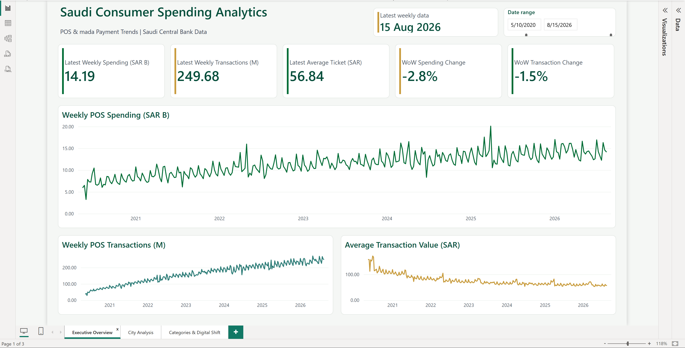
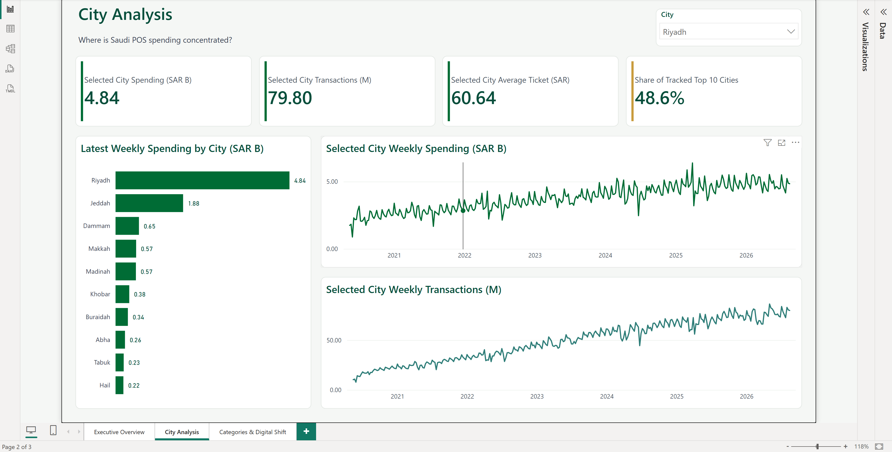
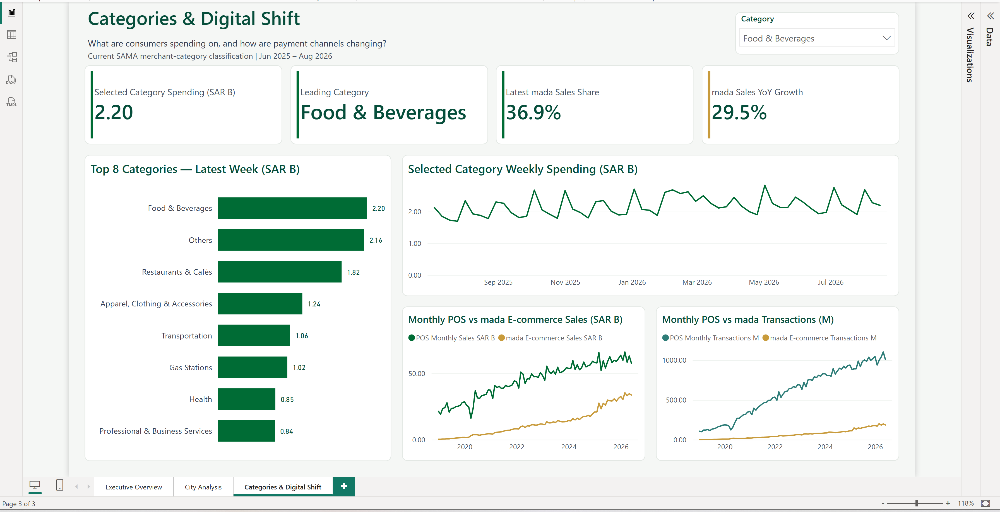

# Saudi Consumer Spending Analytics

Saudi Consumer Spending Analytics is a Power BI project based on Saudi Central Bank (SAMA) payment data. It tracks national weekly POS spending and transaction activity, compares ten consistently covered cities, analyzes the current merchant-category mix, and examines mada e-commerce alongside physical POS.

The scope is deliberately limited to POS and mada payment activity rather than treating the data as a complete measure of consumer spending in Saudi Arabia.

## Why This Project

The goal was to create a Saudi-focused business intelligence project using official data rather than a generic sample dataset. The main challenge turned out to be comparability rather than visualization: the merchant classification changed, city coverage evolved, one reporting week was absent from the prepared values, and some category rows could easily be double counted. The dashboard therefore focuses on a small set of questions that can be answered reliably from the available data.

## Dashboard

### Executive Overview



National weekly POS spending, transactions, and average-ticket trends.

### City Analysis



Latest spending across ten consistently tracked cities and selected-city trends.

### Categories & Digital Shift



Current merchant-category activity and physical POS versus mada e-commerce.

## What the Analysis Covers

1. How is Saudi POS spending changing over time?
2. Where is POS activity concentrated among the ten tracked cities?
3. What are consumers currently spending on by merchant category?
4. How is mada e-commerce developing relative to physical POS?

## Key Findings

- In the week ending **15 Aug 2026**, POS spending reached **SAR 14.19B** across **249.68M transactions**, with a weighted average ticket of **SAR 56.84**. Spending was down **2.8%** and transactions were down **1.5%** from the previous available week.
- Across complete years 2021 to 2025, POS spending increased **49.3%**, transaction count increased **124.3%**, and the weighted average ticket declined **33.4%**. The pattern is consistent with growth becoming more volume-driven.
- **Riyadh** led the ten tracked cities at **SAR 4.84B** and represented **48.6%** of that cohort. Riyadh and Jeddah together accounted for **67.5%**. These figures are not national city market shares.
- **Food & Beverages** led the latest current-taxonomy category ranking at **SAR 2.20B**.
- In Jun 2026, physical POS sales were **SAR 57.48B** versus **SAR 33.63B** for mada e-commerce. mada represented **36.9%** of their combined sales value.
- mada e-commerce grew faster year over year: sales increased **29.5%** and transactions **30.5%**, compared with **6.5%** and **9.8%** for physical POS.

See the [full analysis and interpretation](docs/ANALYSIS_AND_INSIGHTS.md) for context and supporting observations.

## Skills Demonstrated

- Power BI, DAX, Power Query, and Data Modeling
- Data Analysis, Data Visualization, Business Intelligence, Data Cleaning, Data Validation, and Business Analysis

## Data

The Saudi Central Bank is the source authority for the payment data. Structured KAPSARC distributions were used for some historical series and cross-checked against SAMA publications.

The model covers weekly national POS activity, a consistent ten-city cohort, merchant categories under the current SAMA classification, and monthly physical POS and mada e-commerce activity. Full source links and their roles are recorded in the [source register](docs/SOURCES.md).

## Important Data Decisions

- **Merchant taxonomy:** SAMA changed its merchant classification around Jul 2025, so the legacy and current category series remain separate.
- **Double counting:** The current taxonomy contains parent and nested rows. `Total` and child rows are excluded from top-level rankings.
- **Prepared-table gap:** The national table contains a blank row for the week ending 18 Jul 2026, while the city and category tables omit that week. SAMA's official report is available, but its values are not incorporated in this version.
- **City comparability:** Long-run city analysis uses ten consistently covered named cities. Historical `Other`/`Others` records are excluded because their composition changed as named-city reporting expanded.

## How It Works

The source data was checked for units, dates, row structure, and comparability before being organized into separate analytical tables for national POS, cities, merchant categories, and digital payments. Power BI connects them through a shared Date table, with explicit DAX measures driving the dashboard KPIs.

Average ticket is weighted:

```text
Weighted Average Ticket = Total Transaction Value / Total Transaction Count
```

Previous-period measures use the previous available observation instead of assuming that every calendar week exists.

## Limitations

- POS and mada data do not represent all consumer spending in Saudi Arabia.
- Merchant-category trends are limited by the Jul 2025 classification break.
- The city analysis describes a consistent ten-city cohort, not a national city market share.
- The prepared model does not include the official values for the week ending 18 Jul 2026.
- The dashboard is descriptive and diagnostic. Observed relationships do not establish causation.

## Future Work

Possible extensions include automated source checks, inflation-adjusted analysis, calendar-aware comparisons, and formal time-series forecasting. Any forecasting work should begin with simple baselines, preserve chronological train/validation/test order, and report uncertainty. None is implemented in the current dashboard.

## Documentation

- [Analysis and insights](docs/ANALYSIS_AND_INSIGHTS.md)
- [Case study](docs/CASE_STUDY.md)
- [Data dictionary](docs/DATA_DICTIONARY.md)
- [DAX measure reference](docs/DAX_MEASURES.md)
- [Model and validation](docs/MODEL_AND_VALIDATION.md)
- [Source register](docs/SOURCES.md)

## How to Open

1. Open `Saudi_Consumer_Spending_Analytics.pbip` in Power BI Desktop.
2. If the repository is in a different location, open **Transform data > Manage Parameters** and point `DataRoot` to the repository's local `data` folder.
3. Apply the parameter change and refresh.

The PBIP file is the project entry point. A PBIX file is not included.
